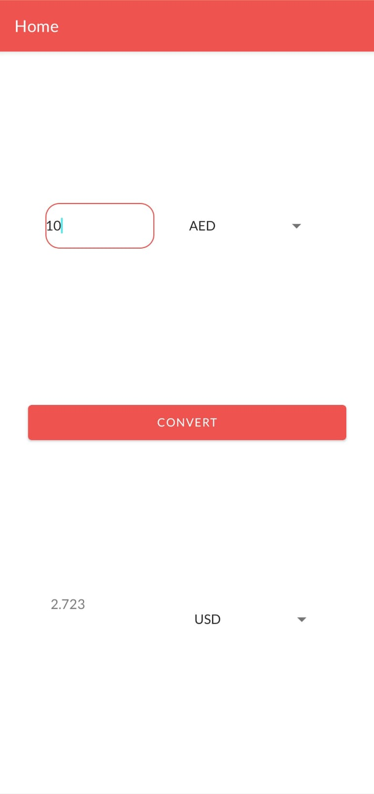

# Currency Converter

Currency Converter is a simple and easy to use Android app that allows its users to get conversion results between selected currencies using real time exchange rates.

# ScreenShot

 

   &nbsp;

## Architecture

This application is done with the [model-view-viewmodel (MVVM) architecture](https://developer.android.com/jetpack/guide).

## Technologies and Libraries Used

* [Livedata](https://developer.android.com/topic/libraries/architecture/livedata) - Automatically updates the UI when data changes
* [Fragments](https://developer.android.com/guide/fragments) - Exposes the app's UI
* [ViewModel](https://developer.android.com/topic/libraries/architecture/viewmodel) - Holds the data
* [View Binding](https://developer.android.com/topic/libraries/view-binding) - Binds the data to the layouts in the xml
* [Retrofit](https://square.github.io/retrofit/) - Fetches the data from the REST API
* [Dependency Injection using Dagger-Hilt](https://developer.android.com/training/dependency-injection/) - Inject dependencies in the classes

## API

The API used in this application is [ExchangeRate-API](https://www.exchangerate-api.com/)